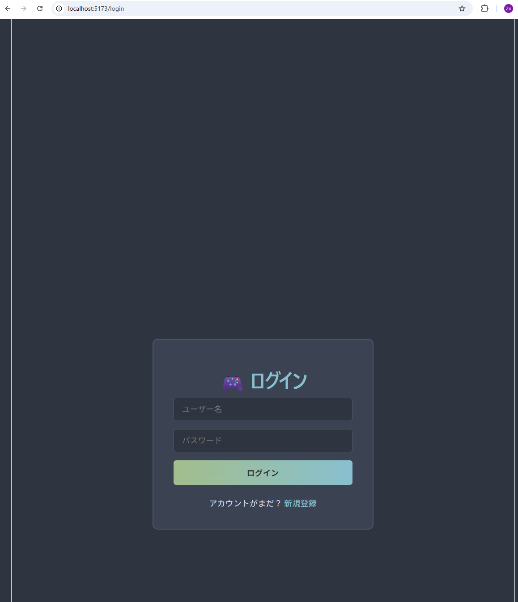
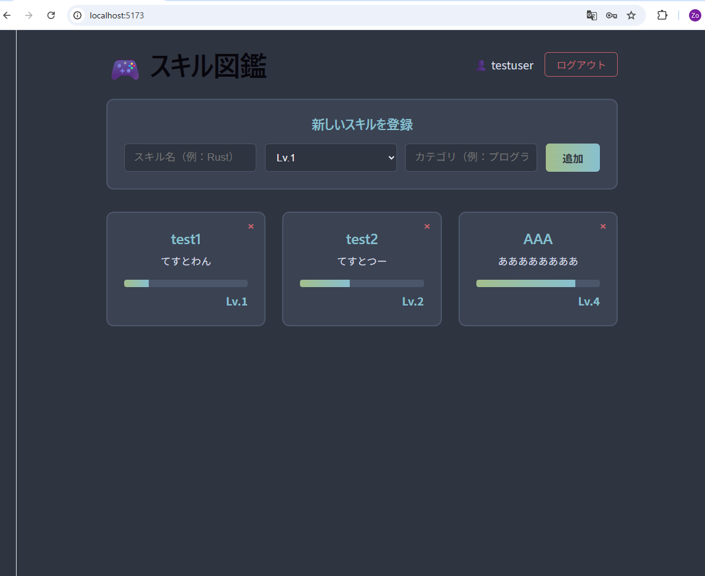

# 🎮 スキル図鑑 (Skill-dex)

ポケ◯ン図鑑風に**自分のスキルを可視化・管理**できるWebアプリ。

学習目的で React + TypeScript + FastAPI + MySQL のフルスタック構成で実装しました。

---

## 📸 スクリーンショット

### ログイン画面


### スキル一覧画面


---

## ✨ 主な機能

- 🔐 **ユーザー認証**（JWT + bcrypt）
- 👤 **マルチユーザー対応**（自分のスキルだけ管理）
- ➕ **スキルの登録・閲覧・削除**（CRUD）
- 🎚️ **レベル管理**（1〜5の5段階）
- 🎨 **Nord配色**の落ち着いたUI
- 📱 **レスポンシブ対応**（CSS Grid）

---

## 🛠️ 技術スタック

### フロントエンド
- **React 18** - UIライブラリ
- **TypeScript** - 型安全な開発
- **Vite** - 開発・ビルドツール
- **React Router v6** - SPA ルーティング
- **Context API** - グローバル認証状態管理

### バックエンド
- **FastAPI** - 高速なPython製APIフレームワーク
- **SQLAlchemy** - ORM
- **Pydantic** - バリデーション
- **python-jose** - JWT発行/検証
- **bcrypt** - パスワードハッシュ化

### データベース
- **MySQL 8.0** - リレーショナルDB
- **utf8mb4** - 絵文字対応

### その他
- **OpenAPI 3.1** - API仕様書自動生成（Swagger UI）
- **CORS Middleware** - クロスオリジン対応

---

## 🏗️ アーキテクチャ

```
[ブラウザ]
   ↓ HTTP
[React (Vite)] http://localhost:5173
   ↓ fetch + JWT
[FastAPI] http://localhost:8000
   ↓ SQLAlchemy
[MySQL]
```

### フロントエンド構成

```
frontend/src/
├── api/client.ts              # API呼び出しの集約
├── context/AuthContext.tsx    # グローバル認証状態
├── pages/
│   ├── HomePage.tsx           # スキル一覧 + 登録フォーム
│   ├── LoginPage.tsx          # ログイン画面
│   └── RegisterPage.tsx       # 新規登録画面
├── types/index.ts             # 型定義
├── App.tsx                    # ルーター設定
└── main.tsx                   # エントリポイント
```

### バックエンド構成

```
backend/
├── main.py        # FastAPI エンドポイント
├── auth.py        # JWT・パスワードハッシュ
├── models.py      # SQLAlchemy モデル
└── database.py    # DB接続設定
```

---

## 🔐 認証フロー

```
1. /register でユーザー登録（パスワードはbcryptでハッシュ化保存）
2. /login でJWT発行
3. JWTをlocalStorageに保存
4. 以降のAPIリクエストに Authorization: Bearer <token> を付与
5. バック側でJWT検証 + 認可（自分のスキルのみアクセス可）
```

---

## 🚀 起動方法

### 必要環境

- Node.js 20+
- Python 3.12+
- MySQL 8.0+

### ① DBセットアップ

```sql
CREATE DATABASE skill_dex CHARACTER SET utf8mb4;
```

### ② バックエンド

```bash
cd backend
python -m venv venv
venv\Scripts\activate
pip install fastapi uvicorn sqlalchemy pymysql cryptography python-jose[cryptography] bcrypt python-multipart
uvicorn main:app --reload
```

→ http://localhost:8000 で起動

API仕様書: http://localhost:8000/docs

### ③ フロントエンド

```bash
cd frontend
npm install
npm run dev
```

→ http://localhost:5173 で起動

---

## 📋 APIエンドポイント

| Method | Path | 用途 | 認証 |
|--------|------|------|------|
| POST | `/register` | ユーザー登録 | 不要 |
| POST | `/login` | ログイン（JWT発行） | 不要 |
| GET | `/me` | 自分の情報取得 | 必要 |
| GET | `/skills` | 自分のスキル一覧 | 必要 |
| POST | `/skills` | スキル登録 | 必要 |
| GET | `/skills/{id}` | スキル詳細 | 必要 |
| PUT | `/skills/{id}` | スキル更新 | 必要 |
| DELETE | `/skills/{id}` | スキル削除 | 必要 |

---

## 🎯 こだわりポイント

### 1. セキュリティ
- パスワードは **bcrypt** でハッシュ化（ソルト自動付与）
- JWT署名で**改ざん検知**
- ユーザーごとの**所有者ベースの認可**

### 2. 設計
- フロント・バックともに**役割ごとにファイル分割**
- TypeScript の型を**フロント・バックで対応**
- API クライアントを**1ファイルに集約**

### 3. UX
- **ホットリロード**による快適な開発体験
- **楽観的UI更新**（削除時の即座反映）
- **ローディング・エラー状態**の明示的なハンドリング

---

## 📚 学んだこと

- React Hooks（useState, useEffect, useContext）
- TypeScript 型安全性の威力
- FastAPI の自動ドキュメント生成
- JWT認証の実装と検証
- SQLAlchemy ORM
- マルチユーザー対応の設計
- CORS、SPA ルーティング、認証フロー

---

## 🚧 今後の改善案

- [ ] スキル編集機能（PUT エンドポイントは実装済みだがUI未対応）
- [ ] カテゴリでのフィルタリング
- [ ] レベルアップ時のアニメーション
- [ ] データ永続化（マイグレーションツール Alembic 導入）
- [ ] パスワード強度チェック
- [ ] ユニット/E2Eテスト
- [ ] Docker化
- [ ] CI/CD（GitHub Actions）

---

## 📝 ライセンス

学習目的のため、特定のライセンスは設定していません。

---

## 👤 作者

**knzooo1236** ([@knzooo1236](https://github.com/knzooo1236))